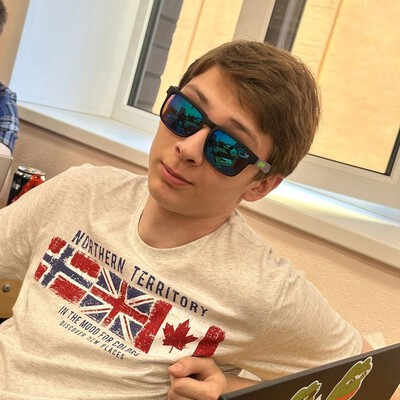

  <!-- Первый блок (заголовок) -->
  

    <!-- Логотип и название -->
    

      🤖
      <h1 style="margin: 0; font-size: 2.4em; font-weight: 800; color: #2d3748; letter-spacing: -0.5px;">DialogX</h1>
    

    <!-- Описание -->
    

      <em>Интеллектуальный автоответчик нового поколения для бизнес-коммуникаций</em>
    

    <!-- Бейджи -->
    

      
        📦 v1.0.0
      
      
        👥 6 Человек
      
    

  

  <!-- Второй блок (содержание) -->
  

    <h2 style="color: #333; margin-top: 0; margin-bottom: 1em; display: flex; align-items: center; font-weight: 600;">
      📋
      Содержание
    </h2>
    

      

        ✨
        <a href="#ключевые-возможности" style="text-decoration: none; color: #2d3748; font-weight: 500; flex-grow: 1;">Возможности</a>
        →
      

       

        🛠️
        <a href="#средства-реализации" style="text-decoration: none; color: #2d3748; font-weight: 500; flex-grow: 1;">Средства реализации</a>
        →
      

      

        🔧️
        <a href="#технологии" style="text-decoration: none; color: #2d3748; font-weight: 500; flex-grow: 1;">Технологии</a>
        →
      

      

        🎨
        <a href="#макеты" style="text-decoration: none; color: #2d3748; font-weight: 500; flex-grow: 1;">Интерфейс</a>
        →
      

      

        👥
        <a href="#команда" style="text-decoration: none; color: #2d3748; font-weight: 500; flex-grow: 1;">Команда</a>
        →
      

      

        📚
        <a href="#документация" style="text-decoration: none; color: #2d3748; font-weight: 500; flex-grow: 1;">Документация</a>
        →
      

    

  

  <!-- Блок "Ключевые возможности" -->
  

    <!-- Заголовок раздела -->
    

      

        ✨
        <h2 style="margin: 0; font-size: 1.4em; font-weight: 700; color: #2d3748;">Ключевые возможности</h2>
      

      
Инновационные решения для автоматизации коммуникаций и управления диалогами

    

    <!-- Умный автоответчик -->
    

      

        

          📨
        

        <h3 style="margin: 0; font-size: 1.2em; font-weight: 600; color: #2d3748;">Умный автоответчик</h3>
      

      

        

          

            

              🤖
            

            <h4 style="margin: 0; font-size: 1.1em; font-weight: 600; color: #2d3748;">AI-генерация ответов</h4>
          

          
Генерация естественных, контекстных ответов на базе нейросети Qwen с поддержкой 15+ языков

        

        

          

            

              🎭
            

            <h4 style="margin: 0; font-size: 1.1em; font-weight: 600; color: #2d3748;">Персонализация</h4>
          

          
Автоматическая адаптация под стиль общения и тон каждого клиента для более персонализированного опыта

        

        

          

            

              ⚡
            

            <h4 style="margin: 0; font-size: 1.1em; font-weight: 600; color: #2d3748;">Быстрые ответы</h4>
          

          
Готовые шаблоны и быстрые ответы для часто задаваемых вопросов с возможностью быстрого выбора

        

      

    

    <!-- Централизованное управление -->
    

      

        

          🌐
        

        <h3 style="margin: 0; font-size: 1.2em; font-weight: 600; color: #2d3748;">Централизованное управление</h3>
      

      

        

          

            

              📥
            

            <h4 style="margin: 0; font-size: 1.1em; font-weight: 600; color: #2d3748;">Единый инбокс</h4>
          

          
Все диалоги из разных платформ собраны в одном удобном интерфейсе с единой системой уведомлений

        

        

          

            

              🔄
            

            <h4 style="margin: 0; font-size: 1.1em; font-weight: 600; color: #2d3748;">Сквозная история</h4>
          

          
Полная история всех коммуникаций с каждым клиентом в хронологическом порядке с тегами и метками

        

        

          

            

              🏷️
            

            <h4 style="margin: 0; font-size: 1.1em; font-weight: 600; color: #2d3748;">Умная сортировка</h4>
          

          
Автоматическая категоризация входящих сообщений по темам, важности и другим параметрам

        

      

    

    <!-- Интеграции -->
    

      

        

          🔌
        

        <h3 style="margin: 0; font-size: 1.2em; font-weight: 600; color: #2d3748;">Интеграции с платформами</h3>
      

      

        

          

            

              📧
            

            <h4 style="margin: 0; font-size: 1.1em; font-weight: 600; color: #2d3748;">Email</h4>
          

          
Поддержка Gmail, Yandex, Outlook с обработкой вложений и HTML-писем

        

        

          

            

              💬
            

            <h4 style="margin: 0; font-size: 1.1em; font-weight: 600; color: #2d3748;">Мессенджеры</h4>
          

          
Telegram, WhatsApp, VK с поддержкой групповых чатов и медиафайлов

        

        

          

            

              🌐
            

            <h4 style="margin: 0; font-size: 1.1em; font-weight: 600; color: #2d3748;">Виджет для сайта</h4>
          

          
Настраиваемый дизайн, JS API и интеграция с аналитическими системами

        

      

    

    <!-- Дополнительные инструменты -->
    

      

        

          📊
        

        <h3 style="margin: 0; font-size: 1.2em; font-weight: 600; color: #2d3748;">Дополнительные инструменты</h3>
      

      

        

          

            

              📊
            

            <h4 style="margin: 0; font-size: 1.1em; font-weight: 600; color: #2d3748;">CRM-система</h4>
          

          
Управление клиентской базой, сделками и воронками продаж с автоматическим созданием карточек

        

        

          

            

              📈
            

            <h4 style="margin: 0; font-size: 1.1em; font-weight: 600; color: #2d3748;">Аналитика</h4>
          

          
Детальная статистика по ответам, клиентам и эффективности работы команды с графиками

        

        

          

            

              🛡️
            

            <h4 style="margin: 0; font-size: 1.1em; font-weight: 600; color: #2d3748;">Безопасность</h4>
          

          
End-to-end шифрование, двухфакторная аутентификация и контроль доступа на основе ролей

        

      

    

    <!-- Почему эффективен -->
    

      

        

          

            💡
          

          Почему DialogX - это эффективное решение?
        

        

          

            

              ✓
              

                <h4 style="margin: 0 0 0.3em 0; font-size: 1em; color: #2d3748;">Экономия времени</h4>
                
<strong>80% времени</strong> за счет автоматизации рутинных ответов

              

            

            

              ✓
              

                <h4 style="margin: 0 0 0.3em 0; font-size: 1em; color: #2d3748;">Скорость реакции</h4>
                
<strong>На 40% быстрее</strong> обработка запросов клиентов

              

            

            

              ✓
              

                <h4 style="margin: 0 0 0.3em 0; font-size: 1em; color: #2d3748;">Командная работа</h4>
                
<strong>Единое пространство</strong> для всей команды

              

            

            

              ✓
              

                <h4 style="margin: 0 0 0.3em 0; font-size: 1em; color: #2d3748;">Быстрая интеграция</h4>
                
<strong>5 минут</strong> для подключения популярных платформ

              

            

            

              ✓
              

                <h4 style="margin: 0 0 0.3em 0; font-size: 1em; color: #2d3748;">Гибкость</h4>
                
<strong>Настройка под специфику</strong> вашего бизнеса

              

            

          

        

      

    

  

   

  <!-- Заголовок раздела -->
  

    

      🛠️
      <h2 style="margin: 0; font-size: 1.4em; font-weight: 700; color: #2d3748;">Средства реализации</h2>
    

    
Инструменты и платформы, используемые для разработки и развертывания проекта

  

  <!-- Карточки инструментов -->
  

    <!-- Таск-трекер -->
    <a href="https://www.atlassian.com/software/jira" target="_blank" style="text-decoration: none; display: flex;">
      

        

          

            
          

          <h3 style="margin: 0; font-size: 1.2em; font-weight: 600; color: #2d3748;">Таск-трекер</h3>
        

        

        <ul style="color: #4a5568; padding-left: 1.2em; margin: 0; font-size: 0.95em; line-height: 1.8;">
          <li><a href="https://www.atlassian.com/software/jira" target="_blank" style="color: #2b6cb0; text-decoration: none; font-weight: 600; transition: color 0.2s;">Jira</a> - основной инструмент для Agile-разработки</li>
          <li>Гибкие доски (Scrum/Kanban)</li>
          <li>Отслеживание времени и отчетность</li>
        </ul>
      

    </a>
    <!-- Облачная платформа -->
    <a href="https://cloud.yandex.ru/" target="_blank" style="text-decoration: none; display: flex;">
      

        

          

            
          

          <h3 style="margin: 0; font-size: 1.2em; font-weight: 600; color: #2d3748;">Облачная платформа</h3>
        

        

        <ul style="color: #4a5568; padding-left: 1.2em; margin: 0; font-size: 0.95em; line-height: 1.8;">
          <li><a href="https://cloud.yandex.ru/" target="_blank" style="color: #2b6cb0; text-decoration: none; font-weight: 600; transition: color 0.2s;">Yandex Cloud</a> - основная облачная платформа</li>
          <li><a href="https://cloud.yandex.ru/services/managed-kubernetes" target="_blank" style="color: #2b6cb0; text-decoration: none; transition: color 0.2s;">Managed Kubernetes</a></li>
          <li><a href="https://cloud.yandex.ru/services/storage" target="_blank" style="color: #2b6cb0; text-decoration: none; transition: color 0.2s;">Объектное хранилище</a></li>
          <li>Балансировщики нагрузки и CDN</li>
        </ul>
      

    </a>
    <!-- Другие инструменты -->
    

      

        

          🧰
        

        <h3 style="margin: 0; font-size: 1.2em; font-weight: 600; color: #2d3748;">Другие инструменты</h3>
      

      
Дополнительные средства разработки:

      <ul style="color: #4a5568; padding-left: 1.2em; margin: 0; font-size: 0.95em; line-height: 1.8;">
        <li><a href="https://github.com/" target="_blank" style="color: #2b6cb0; text-decoration: none; font-weight: 600; transition: color 0.2s;">GitHub</a> - система контроля версий</li>
        <li><a href="https://www.docker.com/" target="_blank" style="color: #2b6cb0; text-decoration: none; font-weight: 600; transition: color 0.2s;">Docker</a> - контейнеризация приложений</li>
        <li><a href="https://www.figma.com/" target="_blank" style="color: #2b6cb0; text-decoration: none; font-weight: 600; transition: color 0.2s;">Figma</a> - дизайн интерфейсов</li>
      </ul>
    

  

  <!-- Дополнительная информация -->
  

    <h3 style="color: #2d3748; margin-top: 0; margin-bottom: 1em; font-size: 1.1em; font-weight: 600; display: flex; align-items: center;">
      ℹ️
      Почему мы выбрали эти инструменты?
    </h3>
    

      Наш выбор основан на требованиях к масштабируемости, безопасности и удобству разработки. 
      <a href="https://cloud.yandex.ru/" target="_blank" style="color: #2b6cb0; text-decoration: none; font-weight: 600; transition: color 0.2s;">Yandex Cloud</a> предоставляет надежную инфраструктуру с локализацией данных в России, 
      <a href="https://www.atlassian.com/software/jira" target="_blank" style="color: #2b6cb0; text-decoration: none; font-weight: 600; transition: color 0.2s;">Jira</a> обеспечивает прозрачность разработки, а дополнительные инструменты создают 
      полноценную экосистему для эффективной работы команды.
    

  

  <!-- Блок "Технологии" -->
  

    

      

        🛠
        <h2 style="margin: 0; font-size: 1.4em; font-weight: 700; color: #2d3748;">Технологический стек</h2>
      

      
Мы используем передовые технологии для создания высокопроизводительных и масштабируемых решений

    

    

      <!-- Backend Card -->
      

        

          

            🔧
          

          <h3 style="margin: 0; font-size: 1.2em; font-weight: 600; color: #2d3748;">Backend</h3>
        

        

          
          
          
        

        
Мощная серверная часть с автоматическим масштабированием и высокой отказоустойчивостью

      

      <!-- Frontend Card -->
      

  

    

      🎨
    

    <h3 style="margin: 0; font-size: 1.2em; font-weight: 600; color: #2d3748;">Frontend</h3>
  

  

    
    
    
  

  
Современный отзывчивый интерфейс с продуманным UX и мгновенной загрузкой

      <!-- AI Card -->
      

        

          

            🧠
          

          <h3 style="margin: 0; font-size: 1.2em; font-weight: 600; color: #2d3748;">AI & ML</h3>
        

        

          
          
          
        

        
Передовые алгоритмы искусственного интеллекта для умной обработки диалогов

      

    

    

  <h3 style="color: #4a5568; font-weight: 500; margin-bottom: 1.5em;">Технологии в действии</h3>
  

    

      
      
Spring

    

    

      
      
PostgreSQL

    

    

      
      
React

    

    

      
      
JavaScript

    

    

      
      
PyTorch

    

  

    

      

        

          📚
        

        Технические детали и преимущества
      

      

        

          

            <h4 style="color: #2d3748; margin-bottom: 0.5em; font-size: 1em;">Spring Boot</h4>
            <ul style="color: #4a5568; padding-left: 1.2em; margin: 0; font-size: 0.95em; line-height: 1.6;">
              <li>Автоконфигурация компонентов</li>
              <li>Встроенный сервер Tomcat</li>
              <li>Готовность к production</li>
            </ul>
          

          

            <h4 style="color: #2d3748; margin-bottom: 0.5em; font-size: 1em;">React + JavaScript</h4>
            <ul style="color: #4a5568; padding-left: 1.2em; margin: 0; font-size: 0.95em; line-height: 1.6;">
              <li>Типобезопасность кода</li>
              <li>Переиспользуемые компоненты</li>
              <li>Оптимизированный рендеринг</li>
            </ul>
          

          

            <h4 style="color: #2d3748; margin-bottom: 0.5em; font-size: 1em;">Qwen AI</h4>
            <ul style="color: #4a5568; padding-left: 1.2em; margin: 0; font-size: 0.95em; line-height: 1.6;">
              <li>Поддержка 15+ языков</li>
              <li>Контекстные диалоги</li>
              <li>Быстрая генерация</li>
            </ul>
          

        

      

    

  

  <!-- Блок "Макеты интерфейса" -->
  

    <!-- Заголовок раздела -->
    

      

        🎨
        <h2 style="margin: 0; font-size: 1.4em; font-weight: 700; color: #2d3748;">Макеты интерфейса</h2>
      

      
Изучите дизайн DialogX

    

    <!-- Кнопка Figma -->
    

      <a href="https://www.figma.com/design/THqEowgsaIE7EqGseqkRMC/DialogX?node-id=26-157&p=f&t=m6Moh4no6GOvx01c-0" style="display: inline-flex; align-items: center; background: linear-gradient(135deg, #0ACF83 0%, #07b377 100%); color: white; text-decoration: none; padding: 0.8em 1.8em; border-radius: 8px; font-weight: 600; box-shadow: 0 4px 12px rgba(10,207,131,0.3); transition: transform 0.2s, box-shadow 0.2s;">
        🚀
        Посмотреть в Figma
        →
      </a>
    

    <!-- Карточки интерфейсов -->
    

      <!-- Центр управления -->
      

        

          

            📊
          

          <h3 style="margin: 0; font-size: 1.2em; font-weight: 600; color: #2d3748;">Центр управления</h3>
        

        
Единая панель для контроля всех коммуникаций

        <ul style="color: #4a5568; padding-left: 1.2em; margin: 0; font-size: 0.95em; line-height: 1.8;">
          <li>Мониторинг активных диалогов</li>
          <li>Аналитика скорости ответов</li>
          <li>Управление правами операторов</li>
          <li>Настройка рабочих процессов</li>
        </ul>
      

      <!-- Интеграции -->
      

        

          

            🔌
          

          <h3 style="margin: 0; font-size: 1.2em; font-weight: 600; color: #2d3748;">Интеграции</h3>
        

        <ul style="color: #4a5568; padding-left: 1.2em; margin: 0; font-size: 0.95em; line-height: 1.8;">
          <li>Поддержка популярных мессенджеров</li>
          <li>Виджет для сайта</li>
        </ul>
      

      <!-- Умный инбокс -->
      

        

          

            📬
          

          <h3 style="margin: 0; font-size: 1.2em; font-weight: 600; color: #2d3748;">Умный инбокс</h3>
        

        
Все сообщения в одном месте

        <ul style="color: #4a5568; padding-left: 1.2em; margin: 0; font-size: 0.95em; line-height: 1.8;">
          <li>Автосортировка по важности</li>
          <li>Группировка по клиентам</li>
          <li>Быстрые фильтры</li>
          <li>Настраиваемые представления</li>
        </ul>
      

    

  

  <!-- Блок "Команда" -->
  

    <!-- Заголовок раздела -->
    

      

        👥
        <h2 style="margin: 0; font-size: 1.4em; font-weight: 700; color: #2d3748;">Наша команда</h2>
      

      
Команда, создающее инновационные решения для вашего бизнеса

    

    <!-- Карточки команды -->
    

      <!-- Карточка 1 -->
      

        

          
        

        <h3 style="margin: 0 0 0.3em 0; font-size: 1.2em; color: #2d3748;">Флейшман Никита</h3>
        
Team Lead / Backend Dev

        
Архитектура системы и разработка backend-решений

        

          
          
        

      

      <!-- Карточка 2 -->
      

        

          
        

        <h3 style="margin: 0 0 0.3em 0; font-size: 1.2em; color: #2d3748;">Сидоренко Игорь</h3>
        
Backend Dev / DevOps

        
Разработка API и инфраструктурные решения

        

          
          
        

      

      <!-- Карточка 3 -->
      

        

          
        

        <h3 style="margin: 0 0 0.3em 0; font-size: 1.2em; color: #2d3748;">Давыдов Игорь</h3>
        
Frontend Developer

        
Разработка пользовательских интерфейсов

        

          
          
        

      

      <!-- Карточка 4 -->
      

        

          
        

        <h3 style="margin: 0 0 0.3em 0; font-size: 1.2em; color: #2d3748;">Баранник Данил</h3>
        
Аналитик & PM

        
Анализ требований и бизнес стратегия проекта

        

          
          
        

      

      <!-- Карточка 5 -->
      

        

          
        

        <h3 style="margin: 0 0 0.3em 0; font-size: 1.2em; color: #2d3748;">Гончаров Вадим</h3>
        
UX/UI Designer

        
Дизайн интерфейсов и пользовательский опыт

        

          
          
        

      

      <!-- Карточка 6 -->
      

        

          
        

        <h3 style="margin: 0 0 0.3em 0; font-size: 1.2em; color: #2d3748;">Кузнецов Валерий</h3>
        
QA Engineer

        
Тестирование и обеспечение качества

        

          
          
        

      

    

  

  <!-- Блок "Документация" -->
  

    <!-- Заголовок раздела -->
    

      

        📚
        <h2 style="margin: 0; font-size: 1.4em; font-weight: 700; color: #2d3748;">Документация</h2>
      

      
Полный набор документации для разработчиков и пользователей

    

    <!-- Категории документов -->
    

      <!-- Основные документы -->
      

        

          

            📄
          

          <h3 style="margin: 0; font-size: 1.2em; font-weight: 600; color: #2d3748;">Основные документы</h3>
        

        <ul style="color: #4a5568; padding-left: 1.2em; margin: 0; font-size: 0.95em; line-height: 1.8;">
          <li style="margin-bottom: 0.6em;"><a href="docs/SRS.md" style="color: #2b6cb0; text-decoration: none; transition: color 0.2s;">Техническое задание</a></li>
<li style="margin-bottom: 0.6em;"><a href="docs/SRS.md" style="color: #2b6cb0; text-decoration: none; transition: color 0.2s;">Предпроектное исследование</a></li>
          <li style="margin-bottom: 0.6em;"><a href="docs/API.md" style="color: #2b6cb0; text-decoration: none; transition: color 0.2s;">API Reference</a></li>
          <li><a href="docs/ARCHITECTURE.md" style="color: #2b6cb0; text-decoration: none; transition: color 0.2s;">Архитектура системы</a></li>
        </ul>
      

      <!-- Визуальные материалы -->
      

        

          

            🎨
          

          <h3 style="margin: 0; font-size: 1.2em; font-weight: 600; color: #2d3748;">Визуальные материалы</h3>
        

        <ul style="color: #4a5568; padding-left: 1.2em; margin: 0; font-size: 0.95em; line-height: 1.8;">
          <li style="margin-bottom: 0.6em;"><a href="docs/DIAGRAMS/" style="color: #2b6cb0; text-decoration: none; transition: color 0.2s;">Диаграммы и схемы</a></li>
          <li style="margin-bottom: 0.6em;"><a href="presentation.pdf" style="color: #2b6cb0; text-decoration: none; transition: color 0.2s;">Презентация проекта</a></li>
          <li><a href="https://youtu.be/demo" style="color: #2b6cb0; text-decoration: none; transition: color 0.2s;">Видеопрезентация</a></li>
        </ul>
      

      <!-- Технические руководства -->
      

        

          

            🛠
          

          <h3 style="margin: 0; font-size: 1.2em; font-weight: 600; color: #2d3748;">Технические руководства</h3>
        

        <ul style="color: #4a5568; padding-left: 1.2em; margin: 0; font-size: 0.95em; line-height: 1.8;">
          <li style="margin-bottom: 0.6em;"><a href="docs/INSTALL.md" style="color: #2b6cb0; text-decoration: none; transition: color 0.2s;">Руководство по IMAP</a></li>
          <li style="margin-bottom: 0.6em;"><a href="docs/SETUP.md" style="color: #2b6cb0; text-decoration: none; transition: color 0.2s;">Руководство по настройке Telegram Bot</a></li>
          <li><a href="docs/TESTING.md" style="color: #2b6cb0; text-decoration: none; transition: color 0.2s;">Руководство по настройке VK Bot</a></li>
<li><a href="docs/TESTING.md" style="color: #2b6cb0; text-decoration: none; transition: color 0.2s;">Руководство по WhatsApp Business API</a></li>
        </ul>
      

    

    <!-- Дополнительная кнопка -->
    

      <a href="#" style="display: inline-flex; align-items: center; background: white; color: #2d3748; text-decoration: none; padding: 0.8em 1.8em; border-radius: 8px; font-weight: 600; box-shadow: 0 2px 8px rgba(0,0,0,0.1); border: 1px solid #e2e8f0; transition: transform 0.2s, box-shadow 0.2s;">
        📂
        Полная документация
        →
      </a>
    

  

